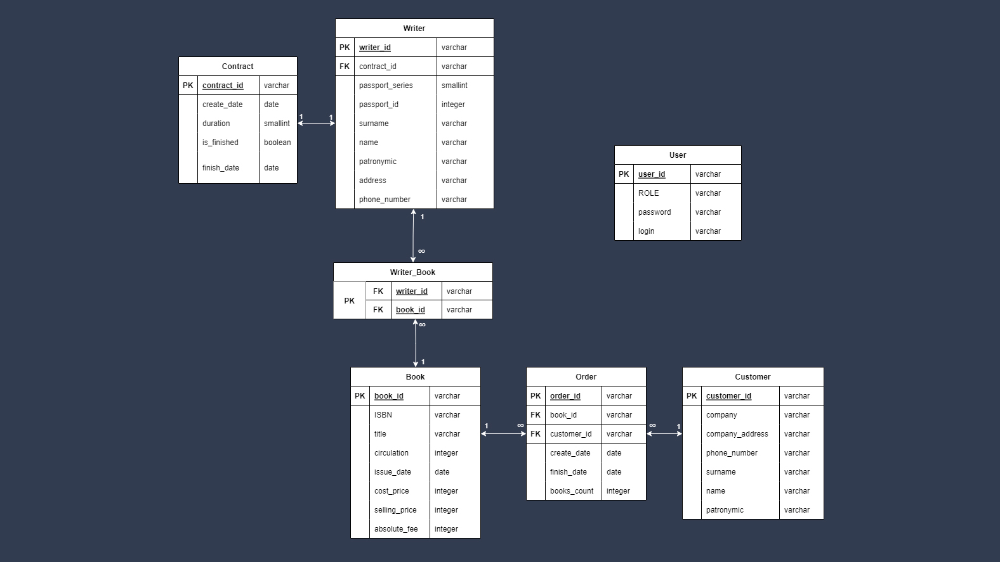

<h1 align="center">Программная система по предметной области "Издательский центр"</h1> 

***

### Описание предметной области:
Издательский центр "Печать" заключает с писателями контракты на издание книг. В течение срока контракта писатели
работают только с этим центром и могут объединяться в творческие группы для совместного написания книг. Издательский
центр может расторгнуть или перезаключить контракт с писателем на новый срок.

Центр издает написанные книги и продает их заказчикам: организациям, магазинам,
библиотекам и др. За изданные книги писатели получают гонорары.

Необходимо спроектировать базу данных Издательский центр, информация которой будет использоваться для определения
гонораров писателям за изданные книги, исчисления срока контракта с писателями, количества написанных книг писателем 
за время контракта, затрат на издание книг, прибыли от продажи книг и др.

---

### Проектирование базы данных:

